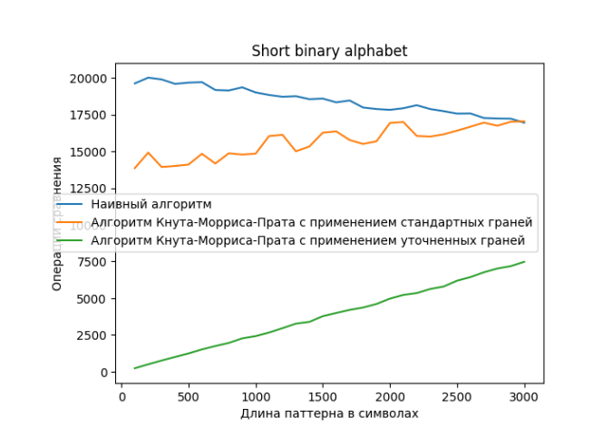
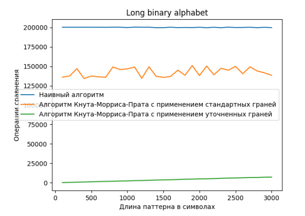
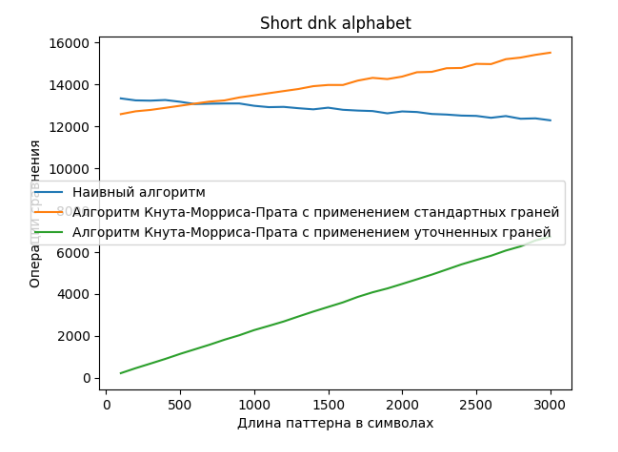
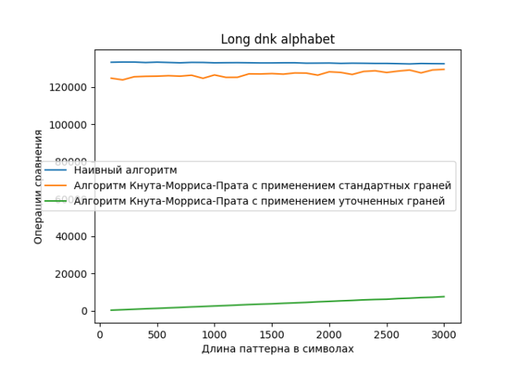

### АиСД-2, 2023
### Балабанов Максим Михайлович, БПИ-212

#### КДЗ-2. Практический анализ алгоритмов поиска вхождений строки-шаблона в тексте 
#### Проектирование и анализ алгоритмов

Среда разработки: Clion

Рассматриваемые алгоритмы:
Класс Algoritms
1) Наивный алгоритм с использованием простого посимвольного сравнения
2) Алгоритм Кнута-Морриса-Прата с применением стандартных гране
3) Алгоритм Кнута-Морриса-Прата с применением уточненных граней

Текст для поиска шаблона:
Класс Generator

Cравнения и анализ:

1. Бинарный алфавит - 10000 символов

 

Заметим, что хуже всех себя показал наивный алгоритм из-за его квадратичной сложности, однако с увеличеничем длины шаблона эффективность КМП со стандартными гранями деградирует из-за сложности постороения автомата. 

Самым эффективным алгоритмом показал себя КМП с утонченными гранями из-за линейной сложности.

2. Бинарный алфавит - 100000 символов

В отличие от предыдущего случая КМП со стандартными гранями деградирует не так быстро, что показывает эффективность КМП на больший данных для бинарного алфавита.

Таким образом, на основе проведенных тестов можно сделать вывод, что алгоритм с утонченными гранями является наиболее эффективным из рассмотренных алгоритмов, особенно на больших объемах входных данных для бинарного алфавита.

3. Алфавит из 4 символов - 10000 символов

В алфавите из 4 символов деградация КМП со стандартными гранями самая показательная за последние три случая.

Таким образом, на основе проведенных тестов можно сделать вывод, что алгоритм с утонченными гранями остается наиболее оптимизированным алгоритмом на относительно небольших данных с алфавитом из 4 символов, из-за его линейной сложности. Наивный алгоритм является наихудшим в данном случае, а алгоритм со стандартными гранями становится менее эффективным при увеличении размера входных данных.

4. Алфавит из 4 символов - 100000 символов

Здесь ситуация почти аналогична бинарному алфовиту и 100000 символам.

Таким образом, на основе проведенных тестов и предположений, можно сделать вывод, что алгоритм с утонченными гранями является наиболее оптимальным на любых количествах символов, а наивный алгоритм остается наихудшим выбором. Алгоритмы со стандартными гранями и автомат КМП также могут проявлять себя неэффективно на больших объемах данных.
